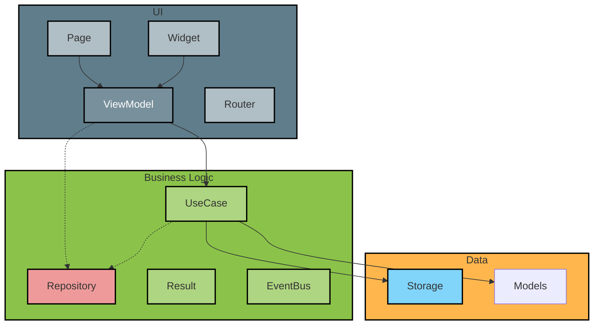
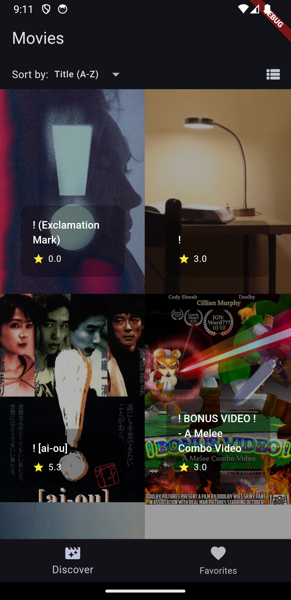
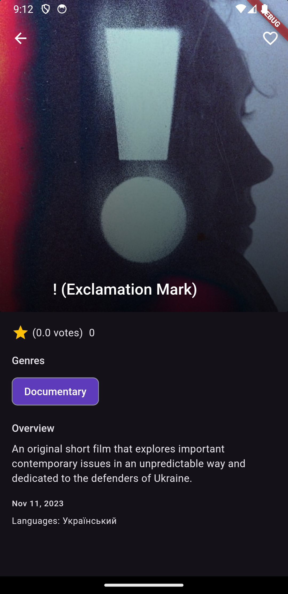

# movie_flutter

List movies and information around them

## Getting Started

### How to run
You can run the project with the following commands:
1. Run `$ make doctor`:
2. Edit `assets/.env` filling missing env variables
3. Run `$ make autogenerate`
4. Run `$ make run`

### Other commands
Run `$make` on console to see the available commands:

```console
$ make
  doctor                         Run you if you have any issues starting the project
  autogenerate                   Auto generate files
  autogenerate_watching          Auto generate files
  test_unit                      Run tests with coverage
  test_integration               Run integration tests
  run                            Run the project on device
  lint                           Run all linters
  build_android                  Build android
  format                         Auto format the code base following lint rules
  check_linters                  Run all linters
  app_uninstall                  Uninstall app from android device for tests
```

### How to test
Steps:
```console
$ make doctor
$ make autogenerate
$ make unit_test
```

> You will see a report with the test coverage in HTML

## Architecture
- Is a layered architecture based on Clean Architecture and SOLID principles. 
   - The presentation layer is designed with `MVVM` and `view states` with **unidirectional data flow**.
   - Environment variables should live in `assets/.env`, you must run `make doctor` to create that file.
   - Some differences with clean architecture:
     - It is thought to show an architecture that can evolute over time based on the project/company requirements but allowing us to still apply good practices over the code. 
     - Not all interfaces are created from the beginning.
     - For everything I did not create a use case, I used the repository directly.
     - I don't mean that clean architecture does not work, but that for a small  project, it is good to follow what you need and works for you and not go creating 1000x clases without having a return on that.
     - Dependency Injection is manually implemented using factory pattern.
   - The codebase does not have any lint warning, and it is using `flutter_lints` and `very_good_analysis` linter rules. 
- The Widgets/Pages/Flutter code is meant to be vanilla, so most of the logic remains in the ViewModel/UseCase and can be tested.
- **Favorite Movie** feature: is using a positive UI strategy to show faster the feedback to the user.
- Folders:
  - `features/`: contains UI components that represent the full window 
  - `widgets/`: contains UI components that represent one small part of the window
  - `common/`: contains all code that can be shared over the project
  - `api/`: contains all logic to communicate with the API
- Tests:
  - I implemented some extensions to add code sugaring, so it is pretty easy to mock requests, futures and streams.
  - Mostly of what is being tested is the business logic, we want to have a lot of these because they run fast.
  - One integration test was added to show the use of mockito and UI Robots pattern.
  - Test coverage generated from `make test_unit` **only contains** unit tests report.
  - Test coverage generated from `make test_integration` **only contains** integration report.
  - I relly on `testing spies` to make tests simpler.
- Components:
   - `EventBus`: used to update the list of favorites if the user changed it, it helps to decouple dependencies but must not be used for everything.
   - `Router`: is a simple custom implementation that allows us to have type safety when navigating between pages:
     - Define what attributes a page requires to start
     - Define what a page returns when it ends
     - Be able to test the navigation with unit testing
  - `Result`: Error / Success handling is done using a [Result Monad](https://adambennett.dev/2020/05/the-result-monad/).

### Architecture diagram


## Screens

| Movies Showcase | Favorite Movies | Movie Detail | 
| --- | --- | --- |
|  |  |  |

## Features

| Clear Error Messages                   | Empty State                  | Retry                       |
|----------------------------------------|------------------------------|-----------------------------|
|  |  |  |

| Endless Pagination                 | Sorting and show in grid or list            | 
|------------------------------------|---------------------------------------------|
|  |  | 


| Remove favorite |  Add favorite | See favorites offline |


