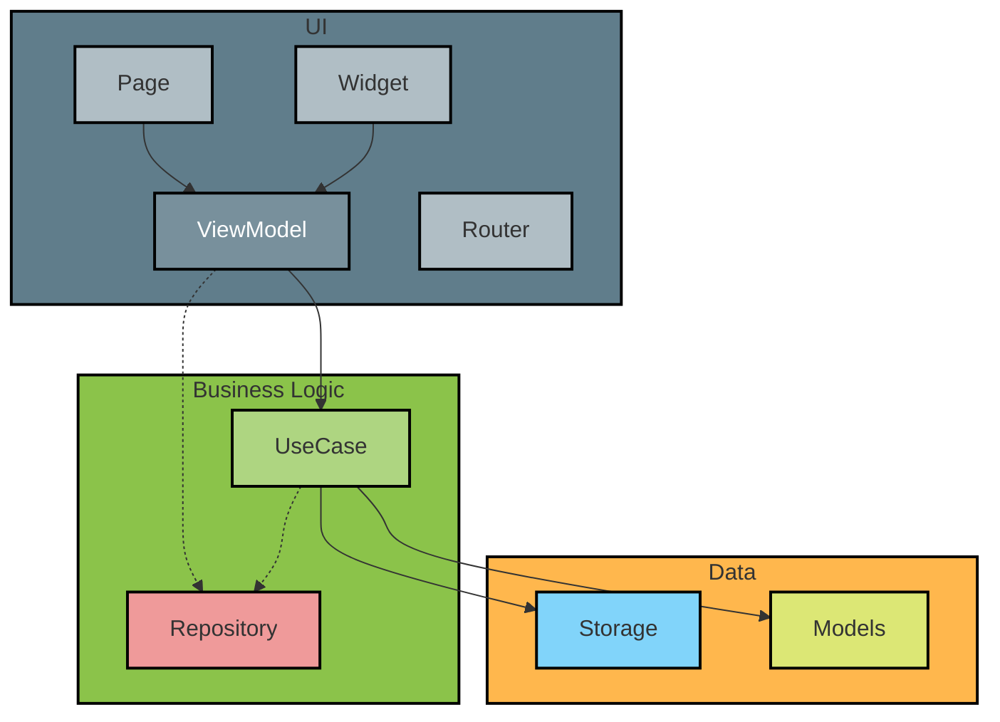

# movie_flutter

List movies and information around them

## Getting Started

Run `$make` on console to see the available commands:

```console
$ make
  test                           Run tests
  run                            Run the project on device
  autogenerate                   Auto generate files
  prepare_watch                  Auto generate files
  build_android                  Build android
  auto_format                    Autoformat the code base following lint rules
  check_linters                  Run all linters
  app_uninstall                  Uninstall app from android device for tests
```

## Architecture
- Is a layered architecture based on Clean Architecture and SOLID principles. 
- Differences with clean architecture:
  - Not all interfaces are created from the beginning.
  - For everything I did not create a use case, I used the repository directly.
  - I don't mean that clean architecture does not work, but that for a small  project, it is good to follow what you need and works for you and not go creating 1000x clases without having a return on that.
- The presentation layer is designed with MVVM and view states with a single.
- The Widgets/Pages/Flutter code is meant to be vanilla, so most of the logic remains in the ViewModel and can be tested.
- Folders:
  - `features/`: contains UI components that represent a full window 
  - `widgets/`: contains UI components that represent one small part of a window
  - `common/`: contains all code that can be shared over the project
  - `api/`: contains all logic to communicate with the API
- Tests:
  - Mostly of what is being tested is the business logic, we want to have a lot of these because they run fast.
- Router: is a simple custom implementation that allows us to have type safety when navigating between pages:
  - Define what attributes a page requires to start
  - Define what a page returns when it ends
  - Be able to test the navigation with unit testing

### Architecture diagram
